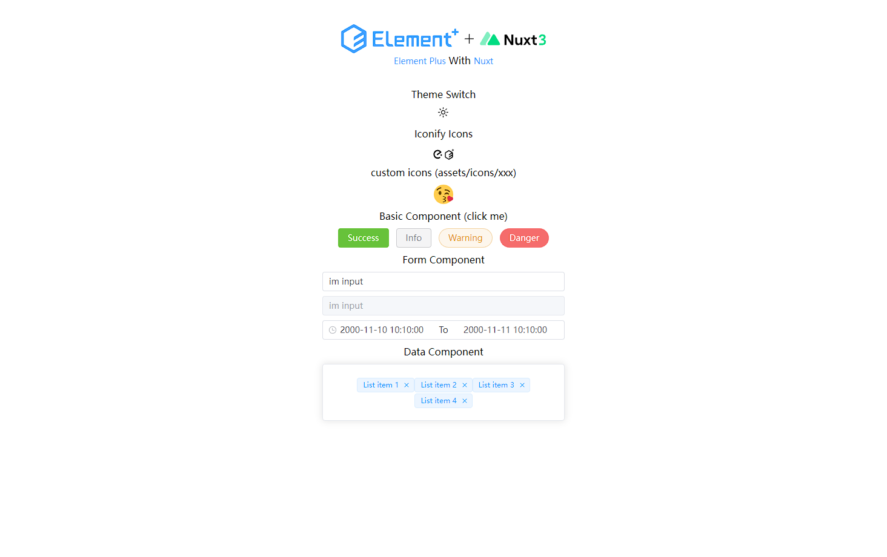
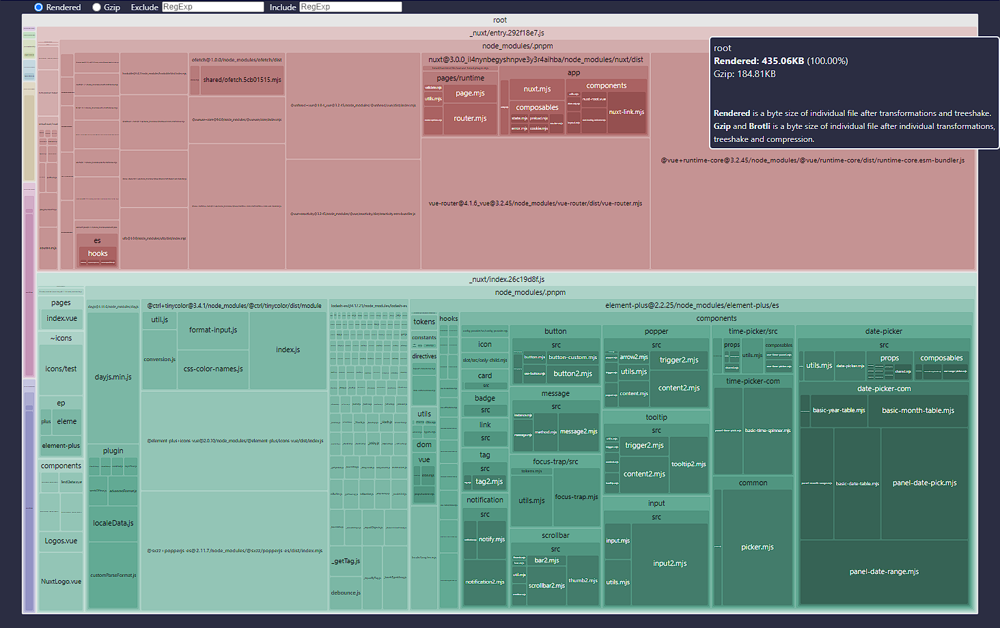

# nuxt3 + element plus 模板

### 在线预览/仓库地址
link: https://element-plus-nuxt3.netlify.app <br>
github: https://github.com/hdw0504/el-plus-nuxt3

### 其余模板
Vue 3.2 + Element-Plus 管理系统\
link: https://v3-admin.netlify.app <br>
github: https://github.com/hdw0504/v3-admin\

### 项目前身今世
基于 [vitesse-nuxt3](https://github.com/antfu/vitesse-nuxt3)\
参考 [element-plus-nuxt-starter](https://github.com/element-plus/element-plus-nuxt-starter)\
由于 `element-plus-nuxt-starter` 并未更新到nuxt3，并且在升级过程中遇到不少问题。\
于是尝试个人搭建个模板方便后续使用。\
包管理使用 `pnpm`，使用 `nr up` 更新依赖（nr 是一个包管理工具名为 [ni](https://github.com/antfu/ni) 的指令）
### 项目技术栈
- **Nuxt 3.0**
  - Nuxt3正式版
- **Element-Plus**
  - 自动引入组件，支持暗黑模式，全局引入样式（按需加载有bug等官方修复）
- **Pinia**
  - 使用 `setup store` 抛弃厚重的 ~~vuex~~ 写法 (拜拜了 `mutation`)
- **vueuse**
  - 自动引入vueuse
- **unocss**
  - 整个项目的样式全用 unocss 编写，简洁代码
- **pnpm**
  - 项目的包管理工具

### 项目截图



### TODO:
- 等问题修复完毕后支持主题定制和按需加载样式


### 发布

```bash
npm run build
```

### 发布预览

```bash
npm run preview
```

### 打包分析

```bash
npm run analyze
```

